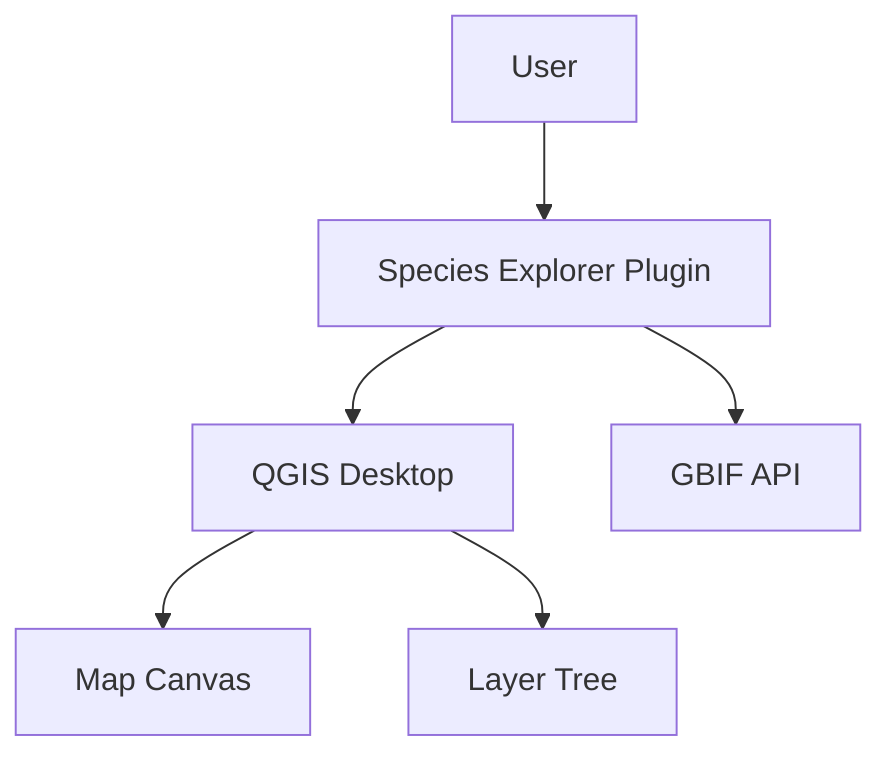
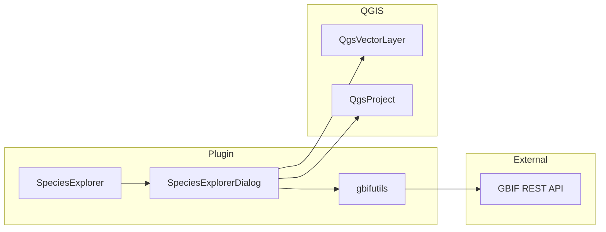
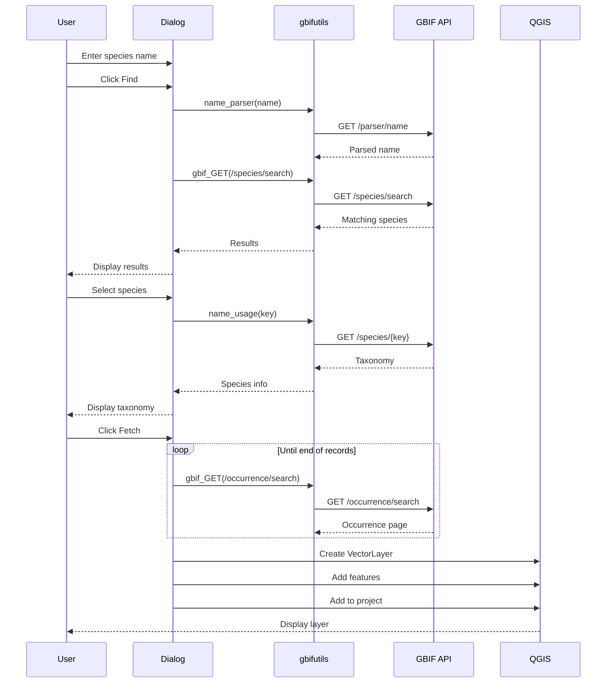

# Species Explorer - Technical Specification

## Overview

Species Explorer is a QGIS plugin that enables users to search, fetch, and visualize species occurrence data from the Global Biodiversity Information Facility (GBIF).

**Version:** 0.2.0
**License:** GPL-2.0+
**Author:** Kartoza (tim@kartoza.com)
**Repository:** https://github.com/kartoza/SpeciesExplorer

---

## User Stories

### US-001: Search for Species

**As a** biodiversity researcher
**I want to** search for species by scientific name
**So that** I can find species occurrence data for my study area

**Acceptance Criteria:**
- User can enter partial or full scientific names
- Search returns matching species from GBIF
- Results display canonical names
- Results are unique (no duplicates)

### US-002: View Taxonomic Information

**As a** researcher
**I want to** view the taxonomic hierarchy of a species
**So that** I can verify I have selected the correct taxon

**Acceptance Criteria:**
- Clicking a species shows taxonomy
- Displays: Kingdom, Phylum, Class, Order, Family, Genus, Species
- Shows Taxon ID and canonical name
- Shows accepted name if different from searched name

### US-003: Fetch Occurrence Data

**As a** GIS analyst
**I want to** download species occurrence records
**So that** I can analyze species distribution in QGIS

**Acceptance Criteria:**
- Fetch button downloads all available records
- Creates a point layer in QGIS
- Layer includes all GBIF attributes
- Records without coordinates are filtered out
- Progress feedback during download

### US-004: Visualize Distribution

**As a** conservationist
**I want to** visualize species distribution on a map
**So that** I can understand the species' geographic range

**Acceptance Criteria:**
- Occurrence points displayed in QGIS
- Layer uses WGS 84 (EPSG:4326)
- Can combine with other GIS layers
- Standard QGIS styling tools available

---

## Functional Requirements

### FR-001: Species Search

| ID | Requirement |
|----|-------------|
| FR-001.1 | Accept scientific or common names as search input |
| FR-001.2 | Query GBIF species/search endpoint |
| FR-001.3 | Filter results to accepted species rank |
| FR-001.4 | Display unique canonical names in results list |
| FR-001.5 | Store GBIF taxon key for each result |

### FR-002: Taxonomy Display

| ID | Requirement |
|----|-------------|
| FR-002.1 | Query GBIF species/{key} endpoint |
| FR-002.2 | Display full taxonomic hierarchy |
| FR-002.3 | Show taxon ID and accepted key |
| FR-002.4 | Handle missing taxonomy fields gracefully |

### FR-003: Occurrence Fetching

| ID | Requirement |
|----|-------------|
| FR-003.1 | Query GBIF occurrence/search endpoint |
| FR-003.2 | Handle paginated responses (100 records per page) |
| FR-003.3 | Download all available records |
| FR-003.4 | Filter records without coordinates |
| FR-003.5 | Show wait cursor during download |
| FR-003.6 | Display "no records" message if empty |

### FR-004: Layer Creation

| ID | Requirement |
|----|-------------|
| FR-004.1 | Create memory point layer |
| FR-004.2 | Set CRS to EPSG:4326 |
| FR-004.3 | Name layer after species canonical name |
| FR-004.4 | Create fields dynamically from first record |
| FR-004.5 | Add all records as features |
| FR-004.6 | Add layer to current project |

---

## Architecture

### System Context



### Component Diagram



### Sequence: Search and Fetch



---

## Data Model

### GBIF Occurrence Fields

Standard fields captured from GBIF occurrence records:

| Field | Type | Description |
|-------|------|-------------|
| id | Integer | Internal record ID |
| gbifID | Long | GBIF occurrence identifier |
| scientificName | String | Full scientific name with authorship |
| decimalLatitude | Double | WGS84 latitude |
| decimalLongitude | Double | WGS84 longitude |
| coordinateUncertaintyInMeters | Double | Coordinate precision |
| eventDate | String | Observation date |
| year | Integer | Observation year |
| month | Integer | Observation month |
| day | Integer | Observation day |
| basisOfRecord | String | Type (HUMAN_OBSERVATION, PRESERVED_SPECIMEN, etc.) |
| institutionCode | String | Data provider code |
| collectionCode | String | Collection code |
| catalogNumber | String | Specimen/record catalog number |
| countryCode | String | ISO 2-letter country code |
| stateProvince | String | State/province name |
| locality | String | Location description |
| identifiedBy | String | Person who identified |
| recordedBy | String | Person who recorded |

*Note: Fields are dynamically created based on available data in the response.*

---

## API Integration

### GBIF Endpoints Used

| Endpoint | Purpose | Method |
|----------|---------|--------|
| `/parser/name` | Parse scientific names | GET |
| `/species/search` | Search for species | GET |
| `/species/{key}` | Get species details | GET |
| `/occurrence/search` | Search occurrences | GET |

### Request Example

```
GET https://api.gbif.org/v1/species/search?
    q=Panthera%20leo&
    rank=SPECIES&
    qField=SCIENTIFIC&
    status=ACCEPTED
```

### Response Handling

- JSON responses parsed with Python json module
- Paginated responses handled with offset parameter
- Network requests via QgsFileDownloader (async)
- Temporary files used for download buffering

---

## Non-Functional Requirements

### NFR-001: Performance

- Search results should display within 5 seconds
- Fetch operation should handle 10,000+ records
- Memory layer creation should be efficient

### NFR-002: Compatibility

- QGIS 3.0 minimum version
- Python 3.9+ compatibility
- Cross-platform (Windows, Linux, macOS)

### NFR-003: Usability

- Clear feedback during long operations
- Informative error messages
- Intuitive dialog layout

### NFR-004: Reliability

- Graceful handling of network errors
- Handle missing data fields
- Validate coordinates before creating features

---

## Testing Requirements

### Unit Tests

| Test | Description |
|------|-------------|
| test_plugin_init | Plugin initializes correctly |
| test_dialog_open | Dialog opens without errors |
| test_search | Search returns results |
| test_layer_creation | Layer created with correct schema |
| test_feature_attributes | Features have correct attributes |

### Integration Tests

| Test | Description |
|------|-------------|
| test_gbif_connection | Can connect to GBIF API |
| test_full_workflow | Complete search to layer workflow |
| test_large_dataset | Handle species with many occurrences |

---

## Future Enhancements

1. **Filter options** - Date range, country, basis of record
2. **Export formats** - CSV, GeoJSON direct export
3. **Batch processing** - Multiple species at once
4. **Offline caching** - Cache recent searches
5. **Custom styling** - Per-species symbology
6. **GBIF downloads** - Use GBIF download API for large datasets
7. **Occurrence preview** - Preview records before full download
8. **Coordinate precision** - Filter by uncertainty

---

## References

- [GBIF API Documentation](https://www.gbif.org/developer/summary)
- [GBIF Species API](https://www.gbif.org/developer/species)
- [GBIF Occurrence API](https://www.gbif.org/developer/occurrence)
- [pygbif Python Client](https://github.com/gbif/pygbif)
- [QGIS Plugin Development](https://docs.qgis.org/3.28/en/docs/pyqgis_developer_cookbook/)

---

Made with :heart: by [Kartoza](https://kartoza.com) | [Donate](https://github.com/sponsors/timlinux) | [GitHub](https://github.com/kartoza/SpeciesExplorer)
