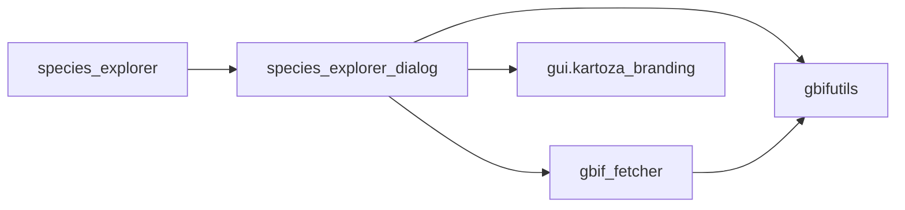

# API Reference

Technical documentation for Species Explorer modules and classes.

## Module Overview



---

## Module: species_explorer

### Class: SpeciesExplorer

Main plugin class that handles QGIS integration.

```python
class SpeciesExplorer:
    """QGIS Plugin for exploring species occurrence data from GBIF."""
```

#### Constructor

##### `__init__(iface: QgisInterface)`

Initialize the plugin.

**Parameters:**

| Name | Type | Description |
|------|------|-------------|
| `iface` | `QgisInterface` | QGIS interface object |

**Attributes Set:**

- `self.iface` - QGIS interface reference
- `self.actions` - List of plugin actions
- `self.menu` - Menu name string
- `self.toolbar` - QToolBar instance
- `self.pluginIsActive` - Boolean state flag
- `self.dlg` - Dialog instance (created on first run)

#### Methods

##### `initGui()`

Initialize the plugin GUI elements. Creates toolbar action and menu entry.

**Effects:**

- Creates toolbar with plugin icon
- Adds menu entry under Plugins

##### `run()`

Show the Species Explorer dialog.

**Behavior:**

- Creates dialog on first call
- Shows dialog as non-modal window

##### `unload()`

Clean up plugin resources when unloading.

**Effects:**

- Removes toolbar actions
- Removes menu entries
- Deletes toolbar

##### `add_action(icon_path, text, callback, ...)`

Helper method to add toolbar/menu actions.

**Parameters:**

| Name | Type | Default | Description |
|------|------|---------|-------------|
| `icon_path` | `str` | Required | Path to icon file |
| `text` | `str` | Required | Action text |
| `callback` | `callable` | Required | Function to call |
| `enabled_flag` | `bool` | `True` | Initial enabled state |
| `add_to_menu` | `bool` | `True` | Add to menu |
| `add_to_toolbar` | `bool` | `True` | Add to toolbar |
| `status_tip` | `str` | `None` | Status bar tip |
| `whats_this` | `str` | `None` | What's This help |
| `parent` | `QWidget` | `None` | Parent widget |

**Returns:**

`QAction` - The created action

##### `tr(message: str) -> str`

Translation helper for internationalization.

**Parameters:**

- `message` - String to translate

**Returns:**

Translated string

---

## Module: species_explorer_dialog

### Class: SpeciesExplorerDialog

Main dialog class with UI logic.

```python
class SpeciesExplorerDialog(QDialog):
    """Dialog for Species Explorer plugin."""
```

#### Constructor

##### `__init__(parent: QWidget = None)`

Initialize the dialog.

**Parameters:**

| Name | Type | Default | Description |
|------|------|---------|-------------|
| `parent` | `QWidget` | `None` | Parent widget |

**Initialization:**

- Loads UI from `.ui` file
- Sets up signal/slot connections
- Initializes Kartoza branding components
- Creates status label

#### Properties

| Property | Type | Description |
|----------|------|-------------|
| `search_text` | `QLineEdit` | Species name input |
| `search_button` | `QPushButton` | Find button |
| `results_list` | `QListWidget` | Search results |
| `taxonomy_list` | `QListWidget` | Taxonomy display |
| `fetch_button` | `QPushButton` | Fetch button |
| `status_label` | `StatusLabel` | Status display |

#### Methods

##### `find()`

Search GBIF for species matching the search text.

**Behavior:**

1. Gets search text from input field
2. Calls `name_parser()` to parse scientific name
3. Queries GBIF `/species/search` endpoint
4. Filters results to ACCEPTED species only
5. Populates results list with unique canonical names

**Side Effects:**

- Updates `results_list` widget
- Updates status label
- Stores species keys in item data

##### `select(item: QListWidgetItem)`

Handle species selection from results list.

**Parameters:**

- `item` - Selected list item

**Behavior:**

1. Gets GBIF taxon key from item data
2. Queries GBIF `/species/{key}` endpoint
3. Extracts taxonomic hierarchy
4. Displays in taxonomy list

**Displayed Fields:**

- Kingdom, Phylum, Class, Order, Family, Genus, Species
- Taxon ID, Canonical Name, Accepted Name

##### `fetch()`

Start async background task to fetch occurrence data.

**Behavior:**

1. Gets species name from selected item
2. Creates `GBIFFetchTask` instance
3. Connects completion callback
4. Adds task to QGIS task manager
5. Updates UI to fetching state

**Side Effects:**

- Disables fetch button during operation
- Updates status with progress
- Adds layer to project on success

##### `_on_fetch_finished(task: GBIFFetchTask)`

Handle completion of async fetch task.

**Parameters:**

- `task` - Completed fetch task

**Behavior:**

- If successful: adds layer to project, shows success status
- If failed: shows error message in red

##### `_set_status(message: str, is_error: bool = False)`

Update status message display.

**Parameters:**

| Name | Type | Default | Description |
|------|------|---------|-------------|
| `message` | `str` | Required | Status message |
| `is_error` | `bool` | `False` | Show as error (red) |

##### `_set_fetching_state(is_fetching: bool)`

Enable/disable UI controls during fetch.

**Parameters:**

- `is_fetching` - True to disable controls

**Effects:**

- Disables/enables fetch button
- Disables/enables search controls
- Updates cursor

##### `closeEvent(event: QCloseEvent)`

Handle dialog close, cancelling any running tasks.

**Behavior:**

- Cancels active fetch task if running
- Accepts close event

---

## Module: gbif_fetcher

### Class: GBIFFetchTask

Async background task for fetching GBIF occurrence data.

```python
class GBIFFetchTask(QgsTask):
    """Non-blocking task for fetching species occurrences from GBIF."""
```

#### Constructor

##### `__init__(species_name: str)`

Create a new fetch task.

**Parameters:**

| Name | Type | Description |
|------|------|-------------|
| `species_name` | `str` | Scientific name to search |

**Attributes:**

| Attribute | Type | Description |
|-----------|------|-------------|
| `species_name` | `str` | Search query |
| `layer` | `QgsVectorLayer` | Result layer (set on success) |
| `error_message` | `str` | Error message (set on failure) |
| `records` | `list` | Fetched occurrence records |

#### Constants

```python
GBIF_PAGE_SIZE = 300      # Records per API request
GBIF_MAX_OFFSET = 100000  # GBIF's hard limit
```

#### Methods

##### `run() -> bool`

Main task execution (runs in background thread).

**Returns:**

`True` on success, `False` on failure

**Behavior:**

1. Fetches occurrences with pagination
2. Processes records
3. Creates vector layer
4. Returns success status

##### `_fetch_occurrences()`

Orchestrate paginated record fetching.

**Behavior:**

- Makes requests until all records fetched or limit reached
- Reports progress during fetch
- Handles pagination automatically

##### `_make_request(offset: int) -> dict`

Make single HTTP request to GBIF.

**Parameters:**

- `offset` - Pagination offset

**Returns:**

JSON response as dictionary

**Raises:**

- `GBIFNetworkError` on connection failure

##### `_process_records(response: dict)`

Process occurrence records from API response.

**Parameters:**

- `response` - GBIF API response

**Behavior:**

- Filters records with valid coordinates
- Sanitizes field names
- Stores in `self.records`

##### `_create_layer()`

Create QgsVectorLayer from fetched records.

**Behavior:**

1. Determines field schema from records
2. Creates memory layer
3. Adds features with geometries
4. Sets layer name to species name

**Result:**

Sets `self.layer` to created layer

##### `finished(result: bool)`

Called when task completes (in main thread).

**Parameters:**

- `result` - Success status from `run()`

**Note:**

This is where callbacks should be connected to handle results.

### Function: fetch_species_async

Convenience function for async fetching.

```python
def fetch_species_async(
    species_name: str,
    on_finished: Callable[[GBIFFetchTask], None]
) -> GBIFFetchTask
```

**Parameters:**

| Name | Type | Description |
|------|------|-------------|
| `species_name` | `str` | Species to search |
| `on_finished` | `callable` | Callback function |

**Returns:**

`GBIFFetchTask` - The created task (already started)

**Example:**

```python
def handle_result(task):
    if task.layer:
        QgsProject.instance().addMapLayer(task.layer)
    else:
        print(f"Error: {task.error_message}")

fetch_species_async("Panthera leo", handle_result)
```

---

## Module: gbifutils

Utilities for interacting with the GBIF API.

### Functions

##### `name_parser(name: str) -> dict`

Parse a scientific name using GBIF name parser.

**Parameters:**

- `name` - Scientific name to parse

**Returns:**

Dictionary with parsed name components:

```python
{
    'scientificName': 'Panthera leo',
    'canonicalName': 'Panthera leo',
    'canonicalNameComplete': 'Panthera leo',
    'genus': 'Panthera',
    'specificEpithet': 'leo',
    'type': 'SCIENTIFIC',
    'parsed': True
}
```

**Raises:**

- `NoResultException` if parsing fails

##### `name_usage(key: int, ...) -> dict`

Get species information by GBIF taxon key.

**Parameters:**

| Name | Type | Default | Description |
|------|------|---------|-------------|
| `key` | `int` | `None` | GBIF taxon key |
| `name` | `str` | `None` | Alternative: search by name |
| `data` | `str` | `'all'` | Data subset to return |
| `language` | `str` | `None` | Preferred language |
| `rank` | `str` | `None` | Taxonomic rank filter |

**Returns:**

Dictionary with species details:

```python
{
    'key': 5219404,
    'scientificName': 'Panthera leo (Linnaeus, 1758)',
    'canonicalName': 'Panthera leo',
    'kingdom': 'Animalia',
    'phylum': 'Chordata',
    'class': 'Mammalia',
    'order': 'Carnivora',
    'family': 'Felidae',
    'genus': 'Panthera',
    'species': 'Panthera leo',
    'kingdomKey': 1,
    'phylumKey': 44,
    'classKey': 359,
    'orderKey': 732,
    'familyKey': 9703,
    'genusKey': 2435194,
    'speciesKey': 5219404,
    'taxonomicStatus': 'ACCEPTED',
    'rank': 'SPECIES'
}
```

##### `gbif_GET(url: str, args: dict = None) -> dict`

Make a GET request to the GBIF API.

**Parameters:**

| Name | Type | Default | Description |
|------|------|---------|-------------|
| `url` | `str` | Required | Full API URL |
| `args` | `dict` | `None` | Query parameters |

**Returns:**

JSON response as dictionary

**Raises:**

- `GBIFNetworkError` on connection failure
- `NoResultException` on empty response

**Implementation:**

- Uses `QgsFileDownloader` for network requests
- Respects QGIS proxy settings
- Handles SSL certificates properly

### Exceptions

##### `NoResultException`

Raised when GBIF returns no results.

```python
class NoResultException(Exception):
    """Raised when GBIF API returns no results."""
```

##### `GBIFNetworkError`

Raised for network/connection failures.

```python
class GBIFNetworkError(Exception):
    """Raised when network request fails."""
```

---

## Module: gui.kartoza_branding

### Constants

```python
KARTOZA_GREEN_DARK = "#589632"
KARTOZA_GREEN_LIGHT = "#93b023"
KARTOZA_GOLD = "#E8B849"
```

### Class: KartozaHeader

Branded header widget with logo and title.

```python
class KartozaHeader(QWidget):
    """Header widget with Kartoza branding."""
```

**Constructor:**

```python
def __init__(
    self,
    title: str = "Species Explorer",
    subtitle: str = "",
    parent: QWidget = None
)
```

### Class: KartozaFooter

Branded footer widget with links.

```python
class KartozaFooter(QWidget):
    """Footer widget with Kartoza links."""
```

**Links Included:**

- Kartoza website
- Donate link
- GitHub repository

### Class: StatusLabel

Color-coded status display widget.

```python
class StatusLabel(QLabel):
    """Status label with color coding."""
```

**Methods:**

##### `set_status(message: str, is_error: bool = False)`

Update status message.

**Parameters:**

- `message` - Text to display
- `is_error` - If True, display in red; else green

### Functions

##### `apply_kartoza_styling(widget: QWidget)`

Apply Kartoza QSS stylesheet to widget.

##### `load_stylesheet() -> str`

Load stylesheet from resources.

##### `get_resources_path() -> str`

Get path to resources directory.

---

## Constants

### GBIF API

```python
GBIF_BASE_URL = "https://api.gbif.org/v1"
```

### Coordinate Reference System

```python
DEFAULT_CRS = "EPSG:4326"  # WGS 84
```

### Pagination

```python
GBIF_PAGE_SIZE = 300
GBIF_MAX_OFFSET = 100000
```

---

## Events and Callbacks

### Task Completion Pattern

The async fetcher uses a callback pattern for completion:

```python
def on_task_finished(task: GBIFFetchTask):
    """Handle task completion."""
    if task.layer:
        # Success - layer is ready
        QgsProject.instance().addMapLayer(task.layer)
    else:
        # Failure - check error
        print(f"Error: {task.error_message}")

# Connect callback
task = GBIFFetchTask("Panthera leo")
task.taskCompleted.connect(lambda: on_task_finished(task))
QgsApplication.taskManager().addTask(task)
```

---

## Examples

### Basic Species Search

```python
from species_explorer.gbifutils import name_parser, name_usage

# Parse a species name
parsed = name_parser("Panthera leo")
print(f"Canonical: {parsed['canonicalName']}")

# Get species details by key
species = name_usage(5219404)
print(f"Kingdom: {species['kingdom']}")
print(f"Family: {species['family']}")
```

### Fetch Occurrences Async

```python
from species_explorer.gbif_fetcher import fetch_species_async
from qgis.core import QgsProject

def handle_result(task):
    if task.layer:
        QgsProject.instance().addMapLayer(task.layer)
        print(f"Added {task.layer.featureCount()} features")
    else:
        print(f"Error: {task.error_message}")

fetch_species_async("Panthera leo", handle_result)
```

### Create Layer Manually

```python
from qgis.core import (
    QgsVectorLayer, QgsFeature, QgsGeometry,
    QgsPointXY, QgsField, QgsFields
)
from PyQt5.QtCore import QVariant

# Create memory layer
layer = QgsVectorLayer(
    "Point?crs=EPSG:4326",
    "Occurrences",
    "memory"
)

# Define fields
fields = QgsFields()
fields.append(QgsField('gbifID', QVariant.String))
fields.append(QgsField('scientificName', QVariant.String))
layer.dataProvider().addAttributes(fields)
layer.updateFields()

# Add features
for occ in occurrences:
    feature = QgsFeature()
    feature.setGeometry(QgsGeometry.fromPointXY(
        QgsPointXY(
            float(occ['decimalLongitude']),
            float(occ['decimalLatitude'])
        )
    ))
    feature.setAttributes([
        occ['gbifID'],
        occ['scientificName']
    ])
    layer.dataProvider().addFeature(feature)

layer.updateExtents()
```

---

Made with 💗 by [Kartoza](https://kartoza.com) | [Donate](https://github.com/sponsors/timlinux) | [GitHub](https://github.com/kartoza/SpeciesExplorer)
