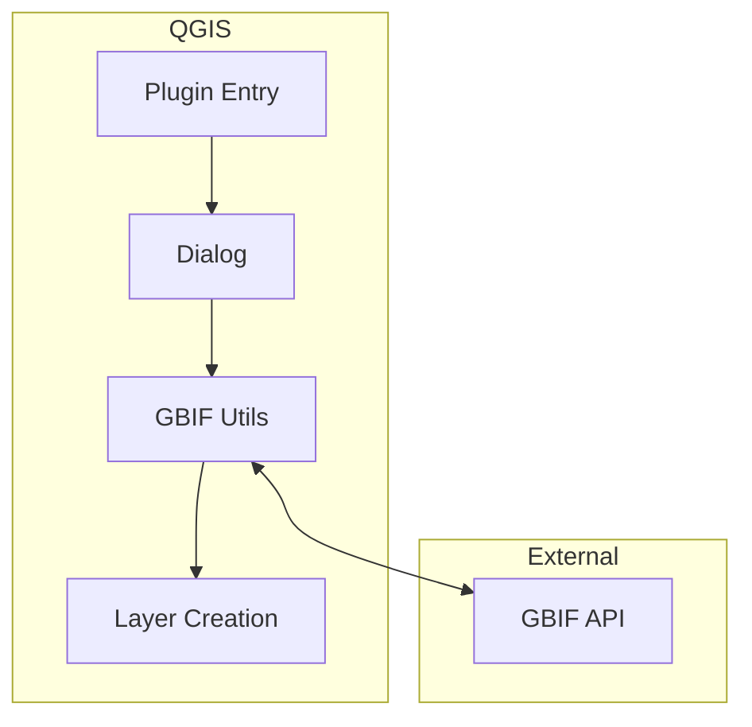
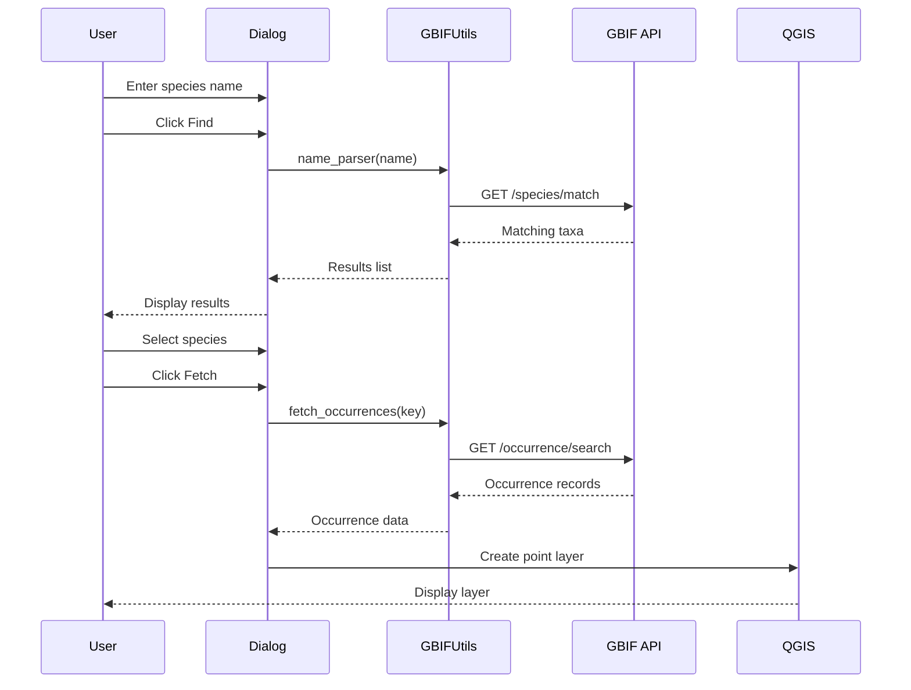

# Architecture

This document describes the architecture and design of Species Explorer.

## Overview

Species Explorer is a QGIS Python plugin that interfaces with the GBIF REST API to fetch and visualize species occurrence data.



## Directory Structure

```
SpeciesExplorer/
├── species_explorer/          # Main plugin package
│   ├── __init__.py           # Plugin initialization
│   ├── species_explorer.py   # Main plugin class
│   ├── species_explorer_dialog.py  # Dialog UI logic
│   ├── species_explorer_dialog_base.ui  # Qt Designer UI
│   ├── gbifutils.py          # GBIF API utilities
│   ├── resources.py          # Compiled resources
│   ├── resources.qrc         # Qt resource file
│   └── icon.png              # Plugin icon
├── test/                      # Test suite
├── docs/                      # Documentation
├── scripts/                   # Helper scripts
└── metadata.txt              # QGIS plugin metadata
```

## Core Components

### Plugin Entry Point

**File:** `species_explorer/__init__.py`

The entry point for QGIS plugin loading:

```python
def classFactory(iface):
    from .species_explorer import SpeciesExplorer
    return SpeciesExplorer(iface)
```

### Main Plugin Class

**File:** `species_explorer/species_explorer.py`

Handles plugin lifecycle:

- `initGui()` - Initialize toolbar and menu
- `run()` - Show the dialog
- `unload()` - Clean up on plugin unload

### Dialog Class

**File:** `species_explorer/species_explorer_dialog.py`

Main user interface and logic:

- `find()` - Search GBIF for species
- `select()` - Display taxonomy information
- `fetch()` - Download occurrence data
- `create_fields()` - Define attribute schema

### GBIF Utilities

**File:** `species_explorer/gbifutils.py`

API interaction layer:

- `name_parser()` - Parse scientific names
- `name_usage()` - Look up taxon details
- `gbif_GET()` - HTTP requests to GBIF API

## Data Flow



## API Integration

### GBIF Endpoints Used

| Endpoint | Purpose |
|----------|---------|
| `/species/match` | Match species names |
| `/species/{key}` | Get species details |
| `/occurrence/search` | Search occurrences |

### Response Handling

GBIF returns JSON responses that are parsed into:

- Species matches (list of taxa)
- Occurrence records (with coordinates)
- Taxonomic hierarchy

## Layer Creation

When data is fetched:

1. Create memory layer with point geometry
2. Define attribute fields
3. Add features for each occurrence
4. Apply default styling
5. Add to QGIS layer tree

### Attribute Schema

```python
fields = QgsFields()
fields.append(QgsField('gbifID', QVariant.LongLong))
fields.append(QgsField('scientificName', QVariant.String))
fields.append(QgsField('decimalLatitude', QVariant.Double))
fields.append(QgsField('decimalLongitude', QVariant.Double))
fields.append(QgsField('eventDate', QVariant.String))
fields.append(QgsField('basisOfRecord', QVariant.String))
fields.append(QgsField('countryCode', QVariant.String))
```

## Error Handling

Errors are handled at multiple levels:

1. **Network errors** - Connection timeouts, HTTP errors
2. **API errors** - Invalid responses, rate limiting
3. **Data errors** - Missing coordinates, invalid data

Errors are displayed to users via QGIS message bar.

## Testing

The test suite covers:

- Plugin initialization
- GBIF API integration
- Dialog functionality
- Layer creation
- Error handling

Run tests with:

```bash
nix run .#test
```

## Extension Points

### Adding New Data Sources

To add additional data sources:

1. Create new utility module (like `gbifutils.py`)
2. Implement search and fetch functions
3. Add UI elements to dialog
4. Update layer creation logic

### Custom Styling

Modify `cluster_style.qml` to change default visualization.

---

Made with 💗 by [Kartoza](https://kartoza.com) | [Donate](https://github.com/sponsors/timlinux) | [GitHub](https://github.com/kartoza/SpeciesExplorer)
