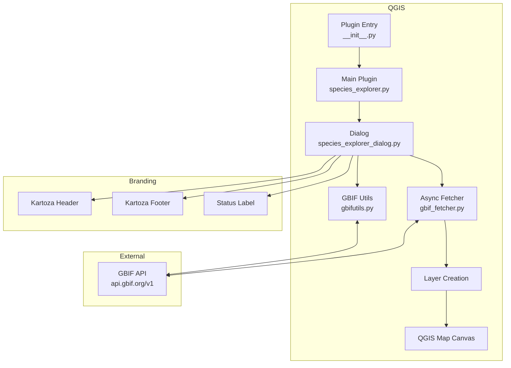
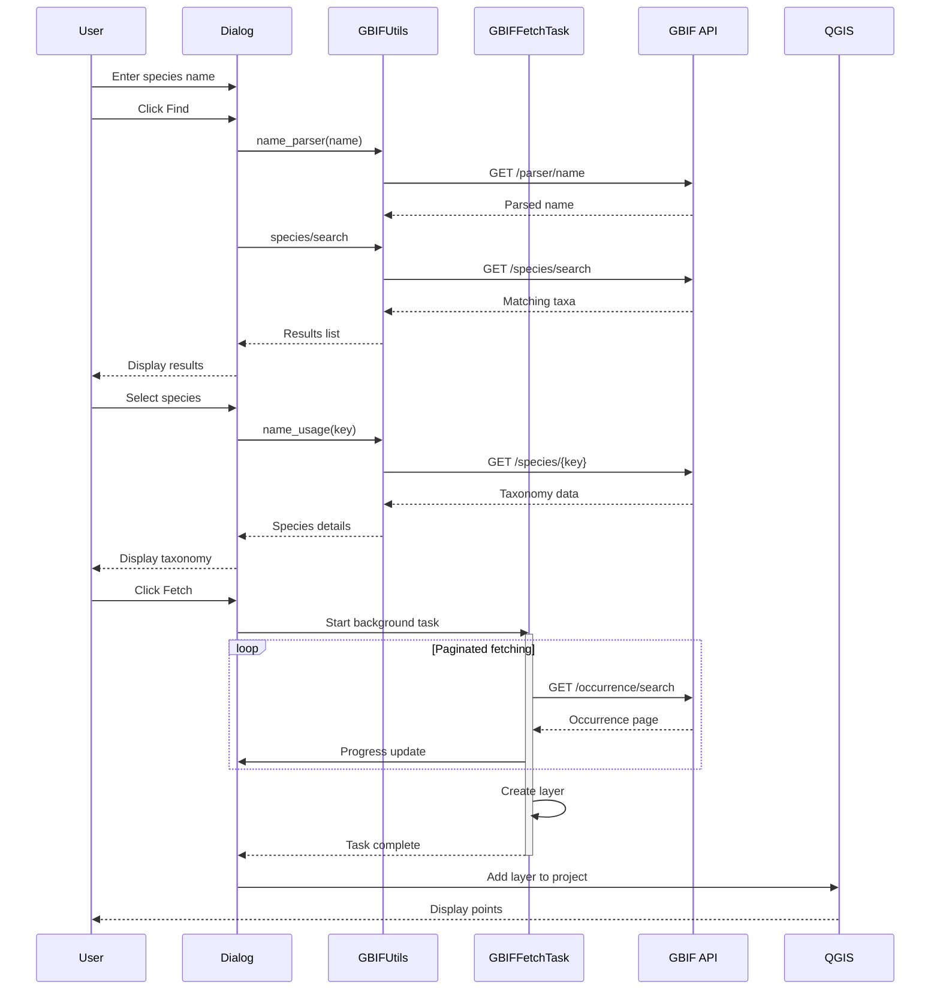
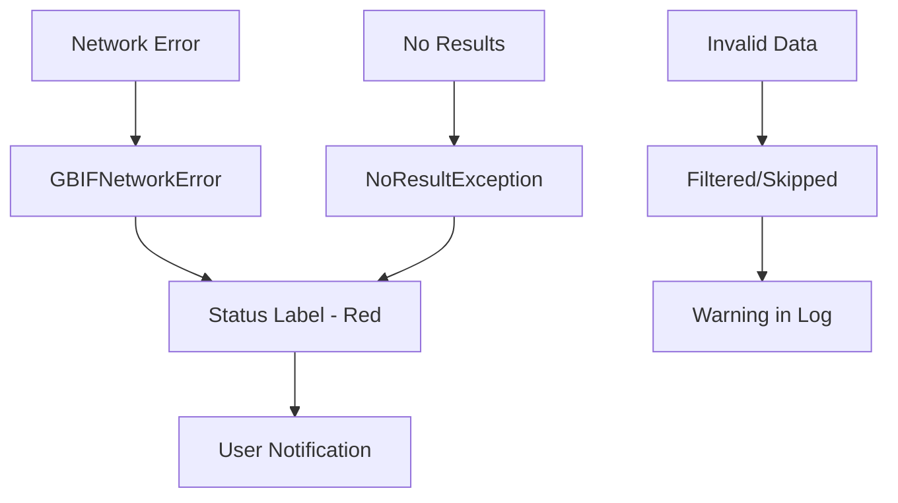
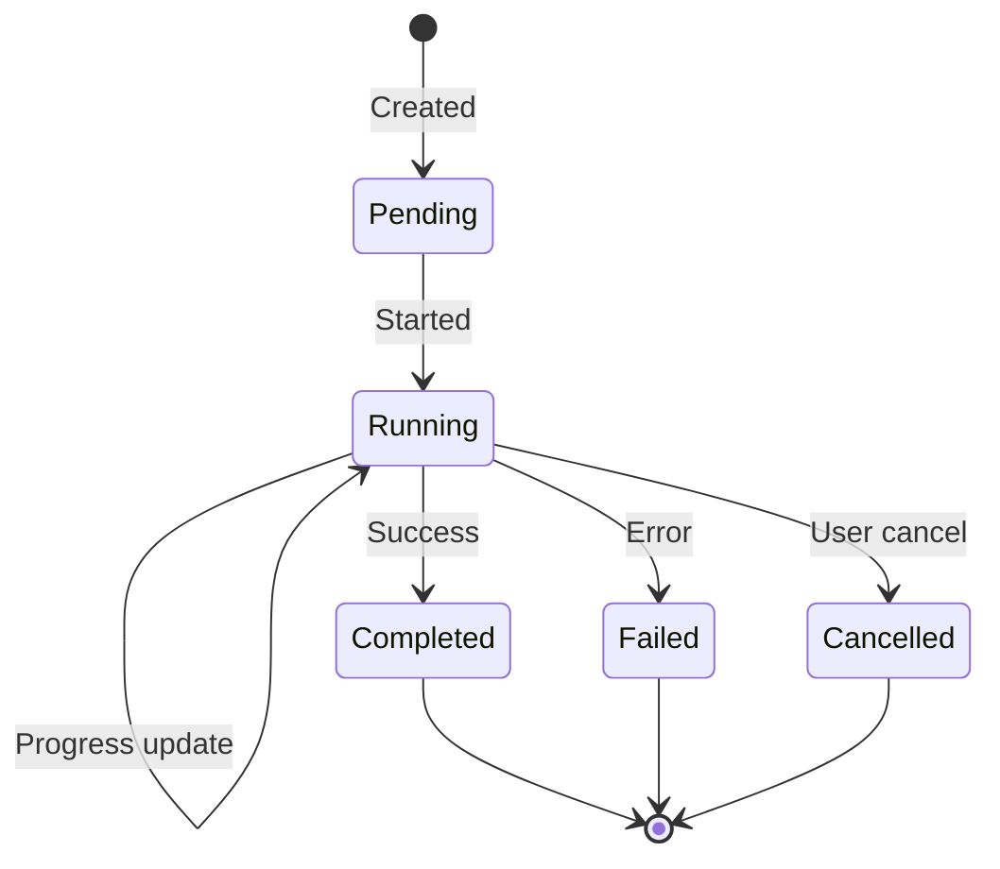

# Architecture

This document describes the architecture and design of Species Explorer.

## Overview

Species Explorer is a QGIS Python plugin that interfaces with the GBIF REST API to fetch and visualize species occurrence data. The plugin uses asynchronous background tasks for non-blocking data fetching.



## Directory Structure

```
SpeciesExplorer/
├── species_explorer/              # Main plugin package (deployed to QGIS)
│   ├── __init__.py               # Plugin initialization & classFactory
│   ├── species_explorer.py       # Main plugin class
│   ├── species_explorer_dialog.py        # Dialog UI logic
│   ├── species_explorer_dialog_base.ui   # Qt Designer UI file
│   ├── gbifutils.py              # GBIF API utilities (sync)
│   ├── gbif_fetcher.py           # Async GBIF fetcher (QgsTask)
│   ├── resources.py              # Compiled Qt resources
│   ├── resources.qrc             # Qt resource definitions
│   ├── icon.png                  # Plugin icon
│   ├── metadata.txt              # QGIS plugin metadata
│   ├── gui/
│   │   └── kartoza_branding.py   # Kartoza branding components
│   └── resources/
│       └── styles/kartoza.qss    # Custom QSS stylesheet
├── test/                          # Test suite
├── docs/                          # MkDocs documentation
├── .github/workflows/             # CI/CD workflows
├── flake.nix                      # Nix development environment
└── mkdocs.yml                     # Documentation configuration
```

**Important:** Only the `species_explorer/` folder is deployed to QGIS. All other files are for development and documentation.

## Core Components

### Plugin Entry Point

**File:** `species_explorer/__init__.py`

The entry point for QGIS plugin loading:

```python
def classFactory(iface):
    from .species_explorer import SpeciesExplorer
    return SpeciesExplorer(iface)
```

### Main Plugin Class

**File:** `species_explorer/species_explorer.py`

Handles plugin lifecycle:

| Method | Purpose |
|--------|---------|
| `__init__(iface)` | Initialize with QGIS interface |
| `initGui()` | Create toolbar and menu items |
| `run()` | Show the Species Explorer dialog |
| `unload()` | Clean up on plugin unload |
| `add_action()` | Helper for toolbar actions |
| `tr()` | Translation support |

### Dialog Class

**File:** `species_explorer/species_explorer_dialog.py`

Main user interface and business logic:

| Method | Purpose |
|--------|---------|
| `find()` | Search GBIF for species |
| `select(item)` | Display taxonomic hierarchy |
| `fetch()` | Start async background fetch |
| `_on_fetch_finished(task)` | Handle fetch completion |
| `_set_status()` | Update status display |
| `_set_fetching_state()` | Toggle UI during fetch |
| `closeEvent()` | Cancel tasks on close |

**UI Elements:**

- `search_text` - Species name input
- `search_button` - Trigger search
- `results_list` - Matching species list
- `taxonomy_list` - Taxonomic hierarchy display
- `fetch_button` - Download occurrences
- `status_label` - Progress/error display

### Async GBIF Fetcher

**File:** `species_explorer/gbif_fetcher.py`

Non-blocking background task for fetching occurrence data:

```python
class GBIFFetchTask(QgsTask):
    """Background task for fetching GBIF occurrences."""
```

**Key Features:**

- Extends `QgsTask` for QGIS task management
- Runs in background thread without blocking UI
- Handles paginated GBIF API responses
- Progress reporting capability
- User-cancellable
- Creates `QgsVectorLayer` from fetched data

**Configuration Constants:**

```python
GBIF_PAGE_SIZE = 300      # Records per request
GBIF_MAX_OFFSET = 100000  # GBIF API hard limit
```

**Methods:**

| Method | Purpose |
|--------|---------|
| `run()` | Main execution in background |
| `_fetch_occurrences()` | Orchestrate pagination |
| `_make_request(offset)` | Single HTTP request |
| `_process_records()` | Parse occurrence data |
| `_create_layer()` | Create QgsVectorLayer |
| `finished(result)` | Callback on completion |

**Usage:**

```python
from species_explorer.gbif_fetcher import fetch_species_async

def on_complete(task):
    if task.layer:
        QgsProject.instance().addMapLayer(task.layer)

fetch_species_async("Panthera leo", on_complete)
```

### GBIF Utilities

**File:** `species_explorer/gbifutils.py`

Synchronous API interaction layer (adapted from pygbif):

| Function | Purpose |
|----------|---------|
| `gbif_GET(url, args)` | HTTP GET with QGIS networking |
| `name_parser(name)` | Parse scientific names |
| `name_usage(key, ...)` | Look up taxon details |

**Exception Classes:**

```python
class NoResultException(Exception):
    """Raised when GBIF returns no results."""

class GBIFNetworkError(Exception):
    """Raised for network failures."""
```

**Networking:**

- Uses `QgsFileDownloader` for QGIS proxy/SSL support
- Synchronous wrapper with `QEventLoop`
- No external HTTP libraries required

### Kartoza Branding

**File:** `species_explorer/gui/kartoza_branding.py`

Consistent branding components:

**Brand Colors:**

```python
KARTOZA_GREEN_DARK = "#589632"
KARTOZA_GREEN_LIGHT = "#93b023"
KARTOZA_GOLD = "#E8B849"
```

**Components:**

| Class | Purpose |
|-------|---------|
| `KartozaHeader` | Branded header with logo |
| `KartozaFooter` | Footer with links |
| `StatusLabel` | Color-coded status display |

## Data Flow

### Complete Workflow Sequence



## API Integration

### GBIF Endpoints Used

| Endpoint | Method | Purpose |
|----------|--------|---------|
| `/parser/name` | GET | Parse scientific names |
| `/species/search` | GET | Search for species |
| `/species/{key}` | GET | Get species details |
| `/occurrence/search` | GET | Search occurrences |

### Query Parameters

**Species Search:**

```
GET /species/search?q={query}&rank=SPECIES&status=ACCEPTED
```

**Occurrence Search:**

```
GET /occurrence/search?scientificName={name}&limit=300&offset={offset}
```

### Response Handling

- JSON responses parsed to Python dicts
- Records filtered for valid coordinates
- Field names sanitized for QGIS compatibility

## Layer Creation

When data is fetched:

1. Create memory layer with Point geometry (EPSG:4326)
2. Define attribute fields dynamically from response
3. Add features for each occurrence with coordinates
4. Add layer to QGIS project

### Field Schema

Fields are created dynamically from GBIF response. Common fields:

| Field | Type | Description |
|-------|------|-------------|
| `gbifID` | String | Unique identifier |
| `scientificName` | String | Full scientific name |
| `decimalLatitude` | String | Latitude |
| `decimalLongitude` | String | Longitude |
| `eventDate` | String | Observation date |
| `basisOfRecord` | String | Record type |
| `countryCode` | String | ISO country code |
| `institutionCode` | String | Data provider |

**Field Name Sanitization:**

- Alphanumeric characters and underscores only
- Maximum 60 characters
- All stored as String(255) for compatibility

## Error Handling

Errors are handled at multiple levels:



**Error Types:**

1. **Network errors** - Connection timeouts, HTTP errors
2. **API errors** - Invalid responses, rate limiting
3. **Data errors** - Missing coordinates, invalid values

**Display:**

- `StatusLabel` shows errors in red
- Successful operations shown in green
- QGIS log contains detailed messages

## Async Architecture

### Why QgsTask?

- **Non-blocking UI** - User can interact during downloads
- **Progress reporting** - Real-time status updates
- **Cancellation support** - User can cancel long operations
- **Thread safety** - Proper handling of Qt signals/slots
- **QGIS integration** - Task manager visibility

### Task Lifecycle



## Testing

The test suite covers:

- Plugin initialization
- GBIF API integration
- Dialog functionality
- Layer creation
- Error handling
- Async task behavior

Run tests with:

```bash
nix run .#test
```

## Extension Points

### Adding New Data Sources

To add additional data sources:

1. Create new utility module (similar to `gbifutils.py`)
2. Create async fetcher (similar to `gbif_fetcher.py`)
3. Add UI elements to dialog
4. Update layer creation logic

### Custom Styling

Modify the default layer styling by:

1. Creating a QML style file
2. Applying style after layer creation
3. Or letting users apply their own styles

---

Made with 💗 by [Kartoza](https://kartoza.com) | [Donate](https://github.com/sponsors/timlinux) | [GitHub](https://github.com/kartoza/SpeciesExplorer)
