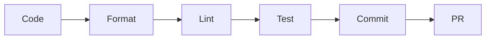

# Developer Guide

Welcome to the Species Explorer Developer Guide! This section covers development setup, architecture, and contribution guidelines.

## Getting Started

<div class="grid cards" markdown>

-   [**Setup**](setup.md)

    Set up your development environment

-   [**Architecture**](architecture.md)

    Understand the plugin structure

-   [**Contributing**](contributing.md)

    How to contribute to the project

-   [**API Reference**](api.md)

    Technical documentation

</div>

## Quick Start for Developers

### 1. Clone the Repository

```bash
git clone https://github.com/kartoza/SpeciesExplorer.git
cd SpeciesExplorer
```

### 2. Enter Development Environment

Using Nix (recommended):
```bash
nix develop
```

This provides all development tools including:

- Python with QGIS bindings
- Testing tools (pytest, coverage)
- Code quality tools (black, flake8, isort)
- Documentation tools (mkdocs)

### 3. Symlink to QGIS

```bash
nix run .#symlink
```

### 4. Launch QGIS

```bash
nix run .#qgis
```

## Development Workflow



### Common Commands

| Command | Description |
|---------|-------------|
| `nix run .#format` | Format code with black and isort |
| `nix run .#lint` | Run linters (flake8, pylint) |
| `nix run .#test` | Run test suite with coverage |
| `nix run .#docs-serve` | Serve documentation locally |
| `nix run .#checks` | Run pre-commit checks |

## Code Standards

- **Python 3.9+** target version
- **120 character** line length
- **Black** for code formatting
- **Google-style** docstrings
- **Type hints** encouraged

## Testing

Run the test suite:

```bash
nix run .#test
```

View coverage report:

```bash
open htmlcov/index.html
```

## Documentation

Build and serve docs locally:

```bash
nix run .#docs-serve
```

Open http://localhost:8000 in your browser.

## Need Help?

- Open an [issue](https://github.com/kartoza/SpeciesExplorer/issues)
- Start a [discussion](https://github.com/kartoza/SpeciesExplorer/discussions)
- Contact [Kartoza](https://kartoza.com)

---

Made with 💗 by [Kartoza](https://kartoza.com) | [Donate](https://github.com/sponsors/timlinux) | [GitHub](https://github.com/kartoza/SpeciesExplorer)
